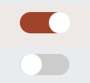

# Vue 3 Toggle Button


For use with **Vue 3**, TypeScript and the **Composition API**. Feedback welcome.



# Usage
Install via NPM
 ```
 npm install vue3-toggle-button
 ```

Then require in your project:
```ts
import { Vue3ToggleButton } from 'vue3-toggle-button'
import '../node_modules/vue3-toggle-button/dist/style.css'

```

Then use it
```html
<Vue3ToggleButton v-model:isActive="isActive" :handleColor="'#cc00cc'"> </Vue3ToggleButton>
```


## Properties

| property | Type  | Default | Description |
| --- | ---  | --- | --- |
| isActive | boolean | false | holds the current boolean state of the button - can be `false` or `true` |
| handleDiameter | number | 30 | Sets the handle diameter (the round button moving) |
| handleColor | string | ```#fff``` | Sets the handle color |
| handleBorderRadius | string | ```50%``` | Sets the handle border radius |
| trackWidth | number | 70 | Sets the track width |
| trackHeight | number | 30 | Sets the track height |
| trackColor | string | ```#ccc``` | Sets the default track color |
| trackColor | string | ```#2196F3``` | Sets the active status track color(after toggled) |
| trackBorderWidth | number | 0 | Sets the track border width |
| trackBorderRadius | string | ```34px``` | Sets the track border radius |


See App.vue for a sample. There is also a folder called local-example with a stand alone example.

```html

<script setup lang="ts">
import { ref } from 'vue'
import Vue3ToggleButton from './components/Vue3ToggleButton.vue'

const isActive = ref(true);

function toggle(value :boolean) {
  isActive.value = !isActive.value;
}
</script>

<template>

  <Vue3ToggleButton v-model:isActive="isActive" :handleColor="'#cc00cc'"> </Vue3ToggleButton>
  <p  @on-change="toggle">Value:  {{isActive}}</p>
</template>

<style>
#app {
  font-family: Avenir, Helvetica, Arial, sans-serif;
}
</style>


This is a Vue 3 version of [vue-toggle-btn](https://www.npmjs.com/package/vue-toggle-btn)
Some code was based on work by [Max Leiter](https://maxleiter.com/)


```